# P1_Probstat_B_5025201176

## Soal 1
### Screenshot Run

### Penjelasan
Untuk bagian a, digunakan dgeom dengan parameter yang diinginkan untuk mendapat nilai probabilitas asli\
Untuk bagian b, nilai simulasi didapatkan dengan generate nilai random 10000 kali menggunkaan rgeom, lalu dicari mean yang nilainya == 3\
Untuk bagian d, Histogram didapat dengan menggunakan fungsi hist pada hasil generate nilai random pada soal b\
Untuk bagian e, rataan dan varian didapat dengan menggunakan fungsi mean dan var pada hasil generate nilai random

## Soal 2
### Screenshot Run
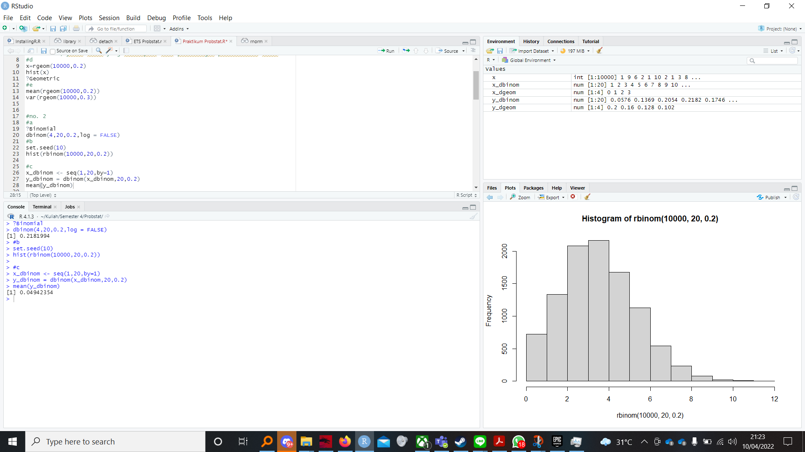
### Penjelasan
Untuk bagian a, digunakan fungsi dbinom dengan parameter yang dibutuhkan\
Untuk bagian b, histogram dibuat dengan fungsi hist pada hasil dari rbinom sebanyak 10000 data, digunakan set.seed(1) agar nilai konsisten\
Untuk bagian c, mean didapat dengan membuat sequence x=1 sampai 20, lalu nilai x dimasukkan kedalam fungsi dbinom, lalu diratakan dengan fungsi mean

## Soal 3
### Screenshot Run
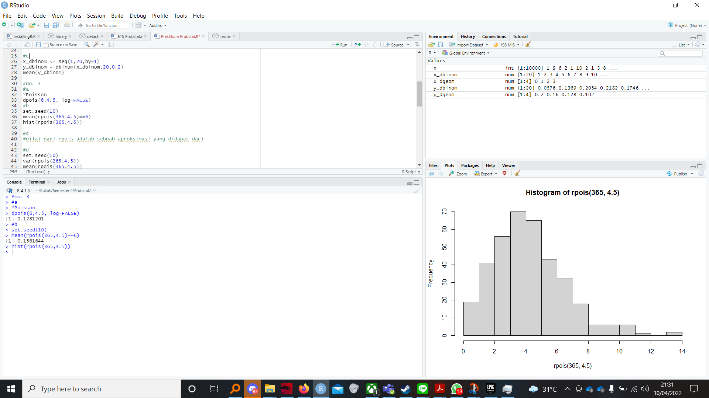
### Penjelasan
Untuk bagian a, digunakan dpois dengan parameter yang dibutuhkan\
Untuk bagian b, nilai simulasi dibuat dengan mengambil mean dari 365 data random yang hasilnya ==6, dapat terlihat bahwa nilai simulasi mendekati nilai riil 
Histogram dibuat dengan fungsi hist dari 365 data random yang dibuat tadi, digunakan set.seed() agar nilai konsisten\
Untuk bagian d, rataan dan variansi diambil dari fungsi mean dan var dari 365 data random yang dibuat

## Soal 4
### Screenshot Run
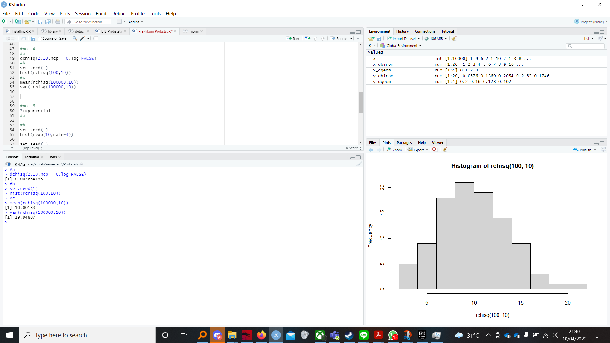
### Penjelasan
Untuk bagian a, digunakan fungsi dchisq dengan parameter yang dibutuhkan\
Untuk bagian b, histogram dibuat dengan fungsi hist dari kumpulan data random yang dibuat oleh fungsi rchisq. set.seed() digunakan agar nilai konsisten\
Untuk bagian c, rataan dan variansi dihitung dari fungsi mean dan var dari kumpulan data random yang dibuat oleh fungsi rchisq
Dapat dilihat bahwa hasil mean mendekati nilai rataan asli dan hasil variansi mendekati rataan*2

## Soal 5
### Screenshot Run
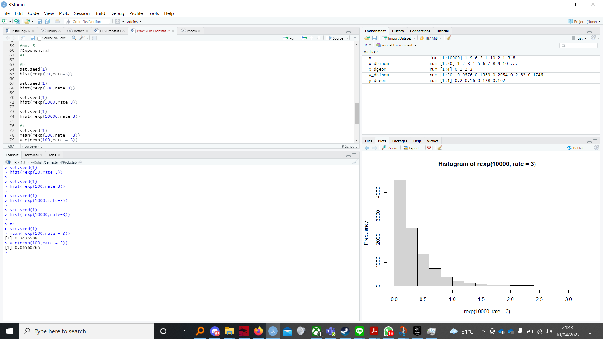
### Penjelasan
Untuk bagian b, semua soal digunakan set.seed() agar nilai konsisten. Histogram dibuat dengan fungsi hist dari hasil generate nilai random dari fungsi rexp. 
Histogram dibuat dengan 4 nilai n/perulangan yang berbeda\
Hasil export histogram:\
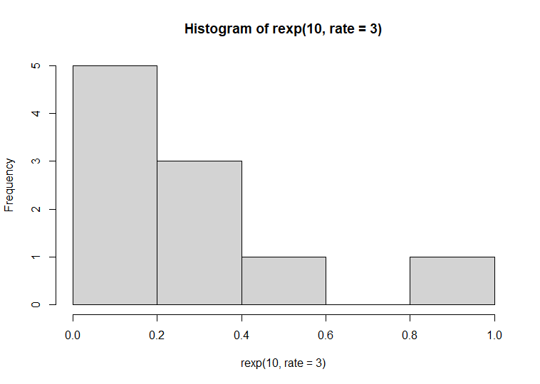
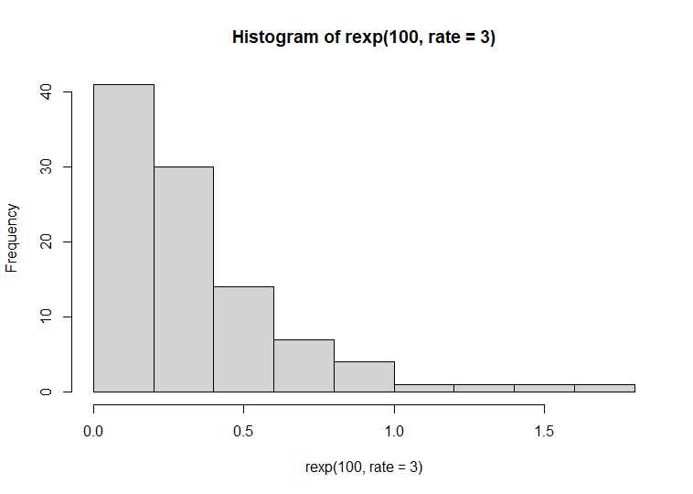
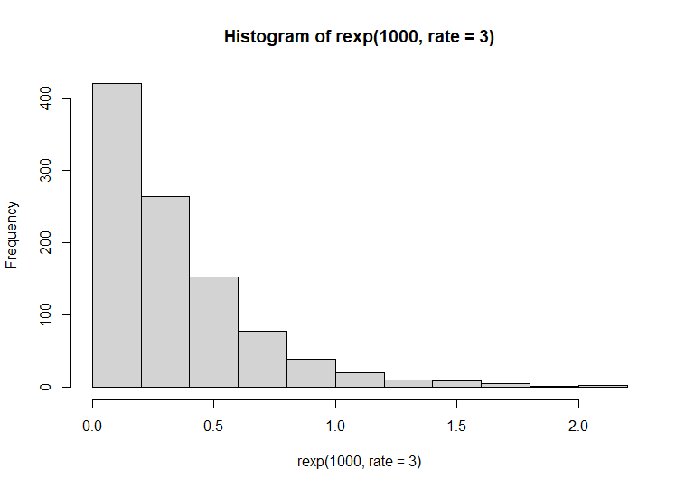
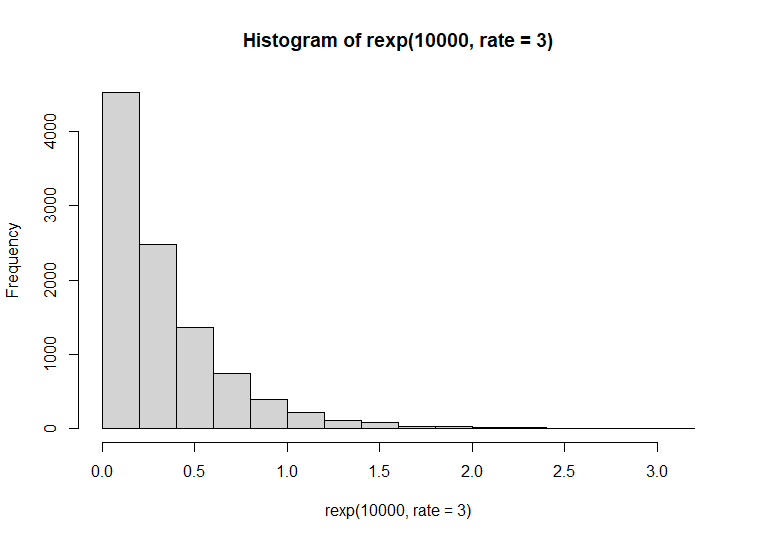\
Untuk bagian c, mean dan var didapat dari hasil generate nilai random dari fungsi rexp.
## Soal 6
### Screenshot Run
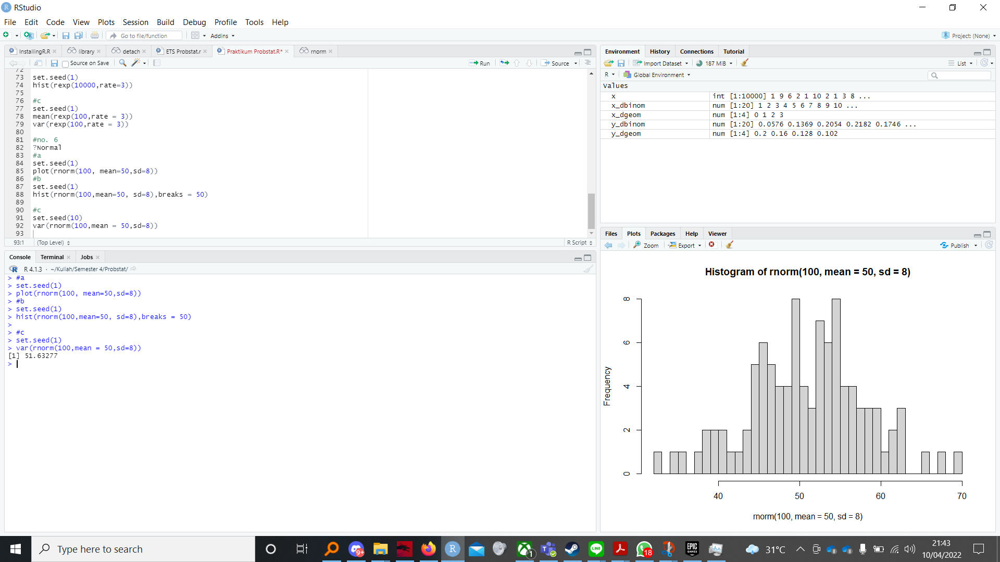
### Penjelasan
Untuk bagian a, plotting dibuat dari fungsi plot dari 100 nilai random yang digenerate oleh fungsi rnorm.\
Hasil Plot:\
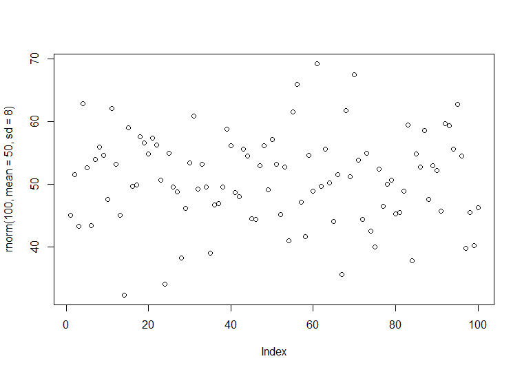\
Untuk soal b, dibuat histogram dari 100 nilai random yang digenerate oleh fungsi rnorm. untuk a dan b, digunakan set.seed() agar nilai konsisten\
Histogram:
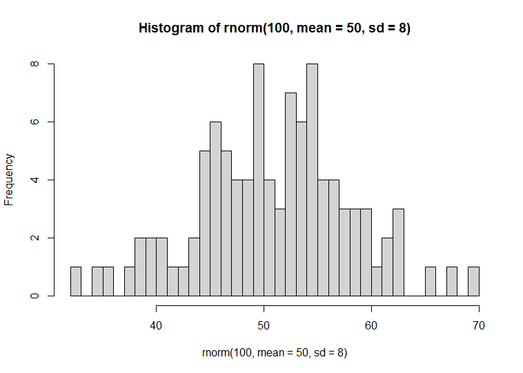

